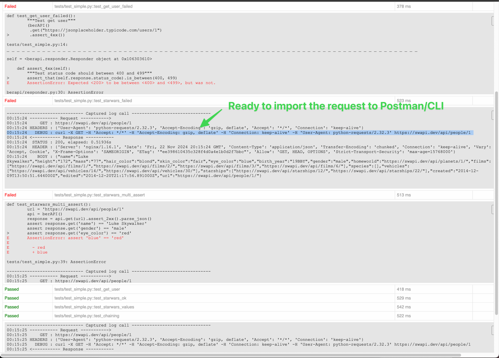

# berAPI

A lightweight Python API client that simplifies API testing using Python and pytest. It supports chained assertions, automatic curl logging, and quick response validation for fast and efficient API testing.

[](https://pypi.org/project/berapi/)
[](https://www.python.org/downloads/)
[](https://opensource.org/licenses/MIT)

## Table of Contents

- [Features](#features)
- [Installation](#installation)
- [Quick Start](#quick-start)
- [API Reference](#api-reference)
  - [berAPI Class](#berapi-class)
  - [Responder Class](#responder-class)
- [Assertion Methods](#assertion-methods)
  - [Header Assertions](#header-assertions)
  - [Status Code Assertions](#status-code-assertions)
  - [Response Body Assertions](#response-body-assertions)
  - [JSON Assertions](#json-assertions)
  - [Schema Validation](#schema-validation)
  - [Performance Assertions](#performance-assertions)
- [Data Access Methods](#data-access-methods)
- [Configuration](#configuration)
- [pytest Integration](#pytest-integration)
- [Examples](#examples)
- [Development](#development)

## Features

- **Fluent API** — Chainable syntax like `.get().assert_2xx().parse_json()`
- **Auto Logging** — Automatically generates curl commands for debugging or Postman import
- **Built-in Assertions** — Status code, response body, JSON key/value, and schema validation
- **Response Time Checking** — Ensure your APIs are fast and stable
- **Base URL & Headers** — Configure once, use everywhere
- **pytest-html Integration** — Rich HTML reports with request/response logs



## Installation

```bash
pip install berapi
```

## Quick Start

```python
from berapi.apy import berAPI

# Simple GET request with assertions
def test_simple():
    api = berAPI()
    response = api.get('https://jsonplaceholder.typicode.com/posts/1')
    response.assert_2xx().assert_contains('userId')

# Fluent chaining style
def test_chaining():
    (berAPI()
     .get('https://jsonplaceholder.typicode.com/posts/1')
     .assert_2xx()
     .assert_value('userId', 1)
     .assert_response_time_less_than(seconds=2))

# Parse and use response data
def test_parse_response():
    api = berAPI()
    data = api.get('https://jsonplaceholder.typicode.com/posts/1').assert_2xx().parse_json()
    assert data['id'] == 1
```

## API Reference

### berAPI Class

The main client class that extends `requests.Session`. It handles HTTP requests and automatic logging.

#### Constructor

```python
berAPI(base_url=None, base_headers=None)
```

| Parameter | Type | Description |
|-----------|------|-------------|
| `base_url` | `str` | Optional. Base URL for all requests. Relative URLs will be joined with this. |
| `base_headers` | `dict` | Optional. Headers to include in all requests. |

#### Example with Base URL and Headers

```python
from berapi.apy import berAPI

# Configure base URL and authentication header
api = berAPI(
    base_url='https://api.example.com/v1',
    base_headers={
        'Authorization': 'Bearer your-token',
        'Content-Type': 'application/json'
    }
)

# Now use relative URLs
api.get('/users')           # GET https://api.example.com/v1/users
api.post('/users', json={}) # POST https://api.example.com/v1/users
```

#### HTTP Methods

All methods return a `Responder` object for chaining.

| Method | Description |
|--------|-------------|
| `get(url, **kwargs)` | Send a GET request |
| `post(url, **kwargs)` | Send a POST request |
| `put(url, **kwargs)` | Send a PUT request |
| `patch(url, **kwargs)` | Send a PATCH request |
| `delete(url, **kwargs)` | Send a DELETE request |

All standard `requests` parameters are supported (`json`, `data`, `params`, `headers`, etc.).

```python
# GET with query parameters
api.get('/search', params={'q': 'test'})

# POST with JSON body
api.post('/users', json={'name': 'John', 'email': 'john@example.com'})

# PUT with custom headers
api.put('/users/1', json={'name': 'Jane'}, headers={'X-Custom': 'value'})

# DELETE
api.delete('/users/1')
```

### Responder Class

Wraps the response and provides assertion and data access methods. All assertion methods return `self` for chaining.

## Assertion Methods

### Header Assertions

| Method | Description |
|--------|-------------|
| `assert_header(key, value)` | Assert response header has specific value |
| `assert_header_exists(key)` | Assert response header exists |
| `assert_content_type(content_type)` | Assert Content-Type header contains value |

```python
# Check specific header value
api.get('/users').assert_header('X-Request-Id', 'abc123')

# Check header exists
api.get('/users').assert_header_exists('X-Rate-Limit')

# Check content type
api.get('/users').assert_content_type('application/json')
api.get('/file.xml').assert_content_type('application/xml')
```

### Status Code Assertions

| Method | Description |
|--------|-------------|
| `assert_status_code(code)` | Assert exact status code |
| `assert_2xx()` | Assert status code is 200-299 (success) |
| `assert_3xx()` | Assert status code is 300-399 (redirect) |
| `assert_4xx()` | Assert status code is 400-499 (client error) |
| `assert_5xx()` | Assert status code is 500-599 (server error) |

```python
# Exact status code
api.get('/users').assert_status_code(200)

# Status code ranges
api.get('/users').assert_2xx()
api.get('/not-found').assert_4xx()
api.post('/users', json={}).assert_status_code(201)
```

### Response Body Assertions

| Method | Description |
|--------|-------------|
| `assert_contains(text)` | Assert response body contains text |
| `assert_not_contains(text)` | Assert response body does not contain text |
| `assert_list_contains_values(values)` | Assert response contains all values in list (soft assertions) |
| `assert_has_length(length)` | Assert response body has exact length |
| `check_contains(text)` | Non-blocking check (logs warning instead of failing) |

```python
# Check if response contains specific text
api.get('/users/1').assert_contains('John')

# Check multiple values (continues even if some fail)
api.get('/users/1').assert_list_contains_values(['name', 'email', 'id'])

# Ensure sensitive data is not exposed
api.get('/users/1').assert_not_contains('password')

# Non-blocking check (warning only)
api.get('/users/1').check_contains('optional_field')
```

### JSON Assertions

| Method | Description |
|--------|-------------|
| `assert_value(key, value)` | Assert JSON property equals value (supports nested keys) |
| `assert_value_not_empty(key)` | Assert JSON property is not empty or None |
| `assert_has_key(key)` | Assert JSON has key (supports nested keys with dot notation) |
| `assert_list_not_empty()` | Assert response is a non-empty JSON array |
| `assert_value_in(key, allowed_values)` | Assert value is one of the allowed values |

```python
# Assert root-level property
api.get('/users/1').assert_value('name', 'John')

# Assert nested property using dot notation
api.get('/users/1').assert_value('address.city', 'New York')
api.get('/users/1').assert_value('company.name', 'Acme Inc')

# Assert property has a value
api.get('/users/1').assert_value_not_empty('email')

# Assert key exists (without checking value)
api.get('/users/1').assert_has_key('id')
api.get('/users/1').assert_has_key('address.street')  # nested key

# Assert list endpoint returns non-empty array
api.get('/users').assert_list_not_empty()

# Assert value is one of allowed values (great for enums/status)
api.get('/users/1').assert_value_in('status', ['active', 'inactive', 'pending'])
api.get('/orders/1').assert_value_in('payment.method', ['credit_card', 'paypal', 'bank_transfer'])
```

### Schema Validation

| Method | Description |
|--------|-------------|
| `assert_schema(file_path)` | Validate response against JSON Schema file |
| `assert_schema_from_sample(file_path)` | Validate response against schema generated from sample JSON |

```python
# Validate against JSON Schema file
api.get('/users/1').assert_schema('schemas/user_schema.json')

# Auto-generate schema from sample response
# Great for quick validation without writing schemas manually
api.get('/users/1').assert_schema_from_sample('samples/user_response.json')
```

**Example JSON Schema file** (`schemas/user_schema.json`):
```json
{
  "$schema": "http://json-schema.org/draft-07/schema#",
  "type": "object",
  "required": ["id", "name", "email"],
  "properties": {
    "id": {"type": "integer"},
    "name": {"type": "string"},
    "email": {"type": "string", "format": "email"}
  }
}
```

### Performance Assertions

| Method | Description |
|--------|-------------|
| `assert_response_time_less_than(seconds)` | Assert response time is under threshold |

```python
# Ensure API responds within 2 seconds
api.get('/users').assert_response_time_less_than(seconds=2)
```

## Data Access Methods

Methods for extracting data from JSON responses.

| Method | Description |
|--------|-------------|
| `parse_json()` | Parse response body as JSON and return it |
| `get_value(key)` | Get value using dot notation (e.g., `'data.user.id'`) |
| `get_data(key=None)` | Get value from `data` property (e.g., `response['data'][key]`) |
| `get_property(key)` | Get root-level property value |

```python
# Parse entire response
data = api.get('/users/1').assert_2xx().parse_json()
print(data['name'])

# Get nested value with dot notation
user_id = api.get('/users/1').assert_2xx().get_value('data.user.id')

# Get from 'data' wrapper (common API pattern)
# For response: {"data": {"id": 1, "name": "John"}}
user_data = api.get('/users/1').assert_2xx().get_data()        # Returns {"id": 1, "name": "John"}
user_name = api.get('/users/1').assert_2xx().get_data('name')  # Returns "John"

# Get root property
status = api.get('/health').assert_2xx().get_property('status')
```

## Configuration

### Environment Variables

| Variable | Default | Description |
|----------|---------|-------------|
| `MAX_TIMEOUT` | `3` | Request timeout in seconds |
| `MAX_RESPONSE_TIME` | `5` | Maximum allowed response time (raises `Timeout` if exceeded) |

```bash
# Set in your shell or .env file
export MAX_RESPONSE_TIME=10
export MAX_TIMEOUT=5
```

## pytest Integration

### pytest.ini Configuration

For detailed request/response logs in your test output:

```ini
[pytest]
log_cli = true
log_cli_level = INFO
log_cli_format = %(message)s

# Optional: Generate HTML report
addopts = --html=report.html --self-contained-html
```

### HTML Reports

Install pytest-html for rich HTML reports:

```bash
pip install pytest-html
```

Run tests with HTML report:

```bash
pytest tests/ --html=report.html --self-contained-html
```

The report includes:
- Full request details (method, URL, headers, body)
- Curl command for easy reproduction
- Response status, headers, and body
- Response time

## Examples

### CRUD Operations

```python
from berapi.apy import berAPI

class TestUserAPI:
    def setup_method(self):
        self.api = berAPI(
            base_url='https://jsonplaceholder.typicode.com',
            base_headers={'Content-Type': 'application/json'}
        )

    def test_create_user(self):
        response = self.api.post('/users', json={
            'name': 'John Doe',
            'email': 'john@example.com'
        })
        response.assert_status_code(201)
        user_id = response.get_property('id')
        assert user_id is not None

    def test_read_user(self):
        (self.api
         .get('/users/1')
         .assert_2xx()
         .assert_value('id', 1)
         .assert_value_not_empty('name'))

    def test_update_user(self):
        (self.api
         .put('/users/1', json={'name': 'Jane Doe'})
         .assert_2xx()
         .assert_value('name', 'Jane Doe'))

    def test_delete_user(self):
        self.api.delete('/users/1').assert_2xx()
```

### Authentication Flow

```python
from berapi.apy import berAPI

def test_login_flow():
    api = berAPI(base_url='https://api.example.com')

    # Login and get token
    login_response = api.post('/auth/login', json={
        'username': 'user@example.com',
        'password': 'password123'
    })
    login_response.assert_2xx()
    token = login_response.get_value('data.token')

    # Use token for authenticated request
    api.headers.update({'Authorization': f'Bearer {token}'})

    # Access protected resource
    (api.get('/users/me')
     .assert_2xx()
     .assert_value_not_empty('email'))
```

### Schema Validation

```python
from berapi.apy import berAPI

def test_response_schema():
    api = berAPI()

    # Validate against explicit schema
    (api.get('https://jsonplaceholder.typicode.com/users/1')
     .assert_2xx()
     .assert_schema('tests/resources/user_schema.json'))

def test_response_matches_sample():
    api = berAPI()

    # Quick validation using sample response
    # Useful when you don't want to write a full schema
    (api.get('https://jsonplaceholder.typicode.com/users/1')
     .assert_2xx()
     .assert_schema_from_sample('tests/resources/sample_user.json'))
```

### Performance Testing

```python
from berapi.apy import berAPI

def test_api_performance():
    api = berAPI()

    # Single request performance
    (api.get('https://jsonplaceholder.typicode.com/posts')
     .assert_2xx()
     .assert_response_time_less_than(seconds=2))

    # Multiple endpoints
    endpoints = ['/posts', '/users', '/comments']
    for endpoint in endpoints:
        (api.get(f'https://jsonplaceholder.typicode.com{endpoint}')
         .assert_2xx()
         .assert_response_time_less_than(seconds=3))
```

## Development

### Setup

```bash
# Clone the repository
git clone https://github.com/fachrulch/berapi.git
cd berapi

# Install Poetry
pip install poetry

# Install dependencies
poetry install --with test
```

### Run Tests

```bash
poetry run pytest tests/
```

### Build and Publish

```bash
poetry build
poetry publish
```

## License

MIT License - see [LICENSE](LICENSE) for details.
